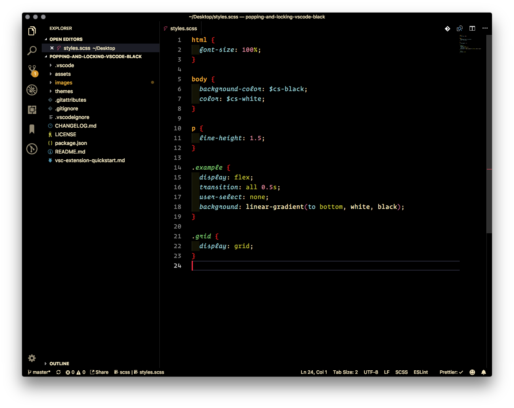
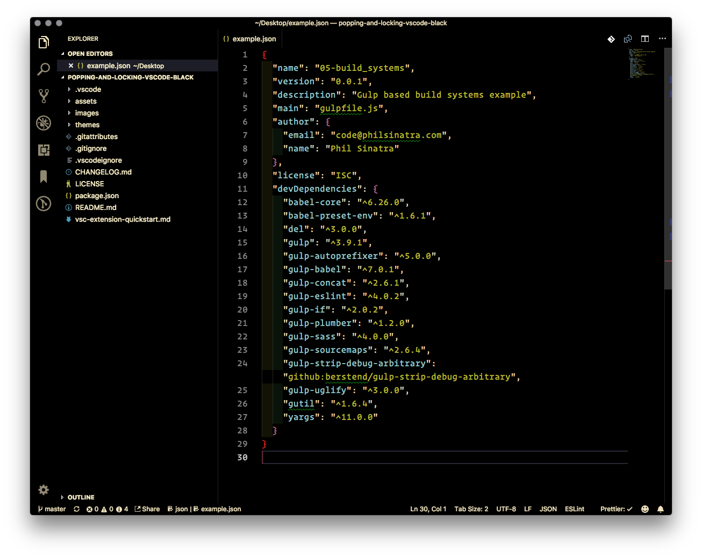

# README

## About

This is a fork of the original [popping-and-locking](https://github.com/hedinne/popping-and-locking-vscode) theme by [Hedinn Eiriksson](https://github.com/hedinne). This version uses pure black as the primary background color throughout the theme.

## Screenshots

### JS

### HTML

### SCSS

### JSON

## Original Theme Notes

This theme is designed to have vivid colors to capture your attention yet be easy on the eyes. Originally based on the color theme VS Dark+, Gruvbox Dark and One Dark but has changed a lot since. It is designed for web languages (HTML, CSS, JS and more).